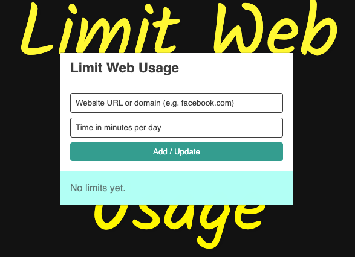

## Limit Web Usage (Chrome Extension)

A minimal Chrome extension that lets you set a daily time limit for distracting websites. It tracks time spent per domain and blocks access for the remainder of the day once the limit is reached.



### Features

-   **Per‑site limits**: Add any domain (e.g., `facebook.com`) with a daily minutes cap.
-   **Automatic tracking**: Time is counted while a limited site’s tab is active and the window is focused.
-   **Smart matching**: Limits apply to the domain and its subdomains (e.g., `news.google.com` matches `google.com`).
-   **Blocking overlay**: When your time is up, an in‑page overlay blocks access for the rest of the day.
-   **Manage limits**: Edit minutes inline or remove a site entirely.
-   **Persistent storage**: Limits sync via `chrome.storage.sync`; usage is stored per‑device via `chrome.storage.local`.

### How it works

-   **Popup UI** (`src/App.tsx`): React + TypeScript app to add, edit, and remove limits. It also shows remaining minutes per site.
-   **Background Service Worker** (`public/background.js`): Tracks active tab changes, window focus, and time deltas using `chrome.alarms`. It calculates usage and decides whether a tab should be blocked. Exposes a small message API:
    -   `LW_GET_LIMITS`, `LW_SET_LIMIT`, `LW_REMOVE_LIMIT`
    -   `LW_GET_STATUS` (for a URL)
    -   `LW_GET_ALL_STATUS` (for the popup summary)
-   **Content Script** (`public/content.js`): Listens for `LW_BLOCK`/`LW_UNBLOCK` messages and injects/removes a full‑page overlay.

### Tech stack

-   React 19, TypeScript 5, Vite 7
-   MV3 Chrome extension (`public/manifest.json`)

### Permissions

Defined in `public/manifest.json`:

-   **tabs**: read current tab URL to determine the site domain
-   **storage**: save limits and daily usage
-   **alarms**: minute‑interval ticks for time accumulation
-   **notifications**: reserved for future use

## Getting started

### Prerequisites

-   Bun 1.1+ ([bun.sh](https://bun.sh))

### Install

```bash
bun install
```

### Build the extension

```bash
bun run build
```

This outputs a production build to `dist/` that includes the popup UI and copies `public/` assets (manifest, background/content scripts, icons).

### Load in Chrome

1. Open `chrome://extensions`.
2. Toggle on **Developer mode** (top right).
3. Click **Load unpacked** and select the `dist/` folder.
4. Pin the extension and click the toolbar icon to open the popup.

### Development tips

-   The popup UI can be previewed with hot reload:
    ```bash
    bun run dev
    ```
    This runs Vite for UI development in the browser. To test inside Chrome as an extension, run a full `bun run build` and reload the unpacked extension.

## Project structure (high level)

```
public/
  manifest.json         # MV3 manifest
  background.js         # Service worker (usage tracking & messaging)
  content.js            # Injected overlay blocker
  icon16.png / 48 / 128 # Icons
src/
  App.tsx               # Popup UI (React)
  main.tsx, index.css   # App entry & styles
```

## Privacy

-   No analytics, no external requests.
-   Limits are stored with `chrome.storage.sync` so they follow your profile; daily usage totals are stored locally via `chrome.storage.local`.

## Troubleshooting

-   After changing background/content scripts, rebuild (`bun run build`) and click **Reload** for the extension in `chrome://extensions`.
-   If the overlay does not appear on a limited site, ensure the content script is running (see the extension’s **Inspect views** in the Extensions page) and that the site domain matches your configured limit.

## License

MIT
